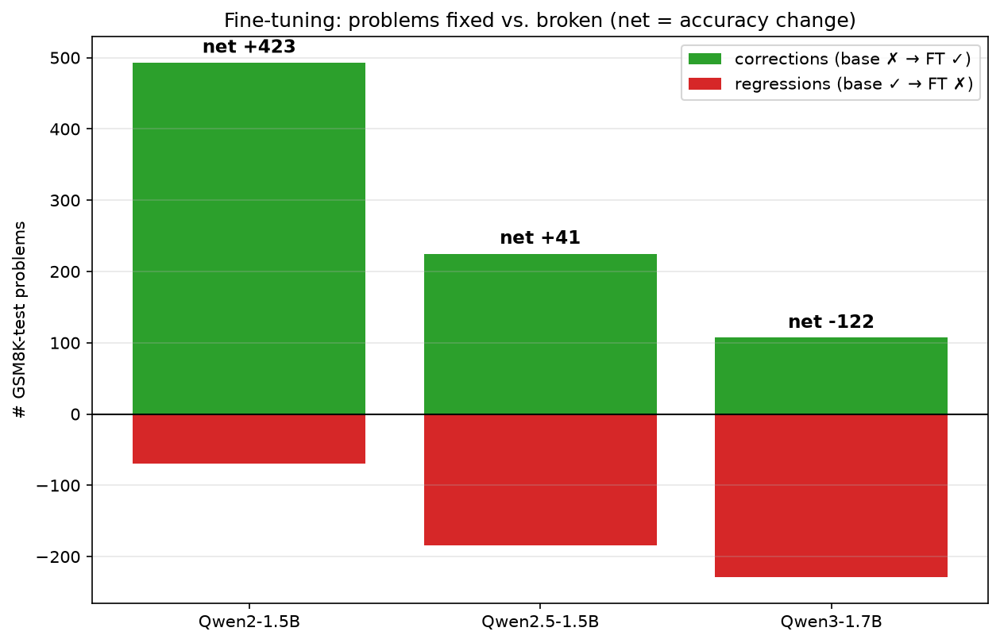
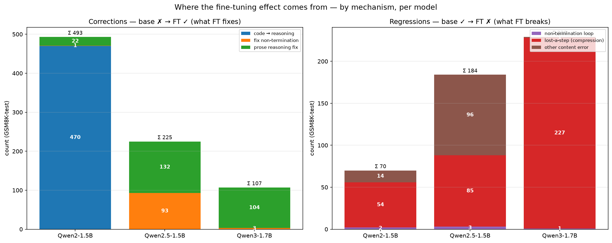
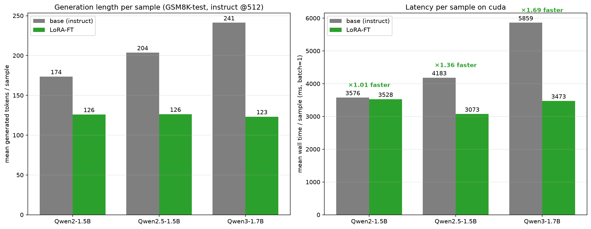

# What does fine-tuning actually change? (and how much faster is it?)

Per-example comparison of the **base** model vs the **best LoRA adapter**, both
prompted *instruct* and scored on the full GSM8K-**test** split (n=1319, 512-token
budget, greedy). We pair every problem and read off where the base and the FT
model disagree — `base ✗ → FT ✓` (a **correction**) and `base ✓ → FT ✗` (a
**regression**) — then categorize each disagreement by its *mechanism*. The same
analysis is run for all three headroom models so the picture tracks the headroom
level. Source completions: `results_headroom/<model>/base_vs_ft_completions.json`;
categorizer: `scripts/categorize_diffs.py`; raw hand-read dumps:
`analysis/_work/<model>_{corrections,regressions}.txt`.

## Net effect (fixed vs. broken)

| Model | base acc | FT acc | corrections (✗→✓) | regressions (✓→✗) | net |
|---|---|---|---|---|---|
| Qwen2-1.5B   | 0.219 | 0.540 | 493 | 70  | **+423** |
| Qwen2.5-1.5B | 0.557 | 0.588 | 225 | 184 | **+41** |
| Qwen3-1.7B   | 0.757 | 0.664 | 107 | 229 | **−122** |

The amount FT *breaks* grows with the base level while the amount it *fixes*
shrinks — same headroom story, now resolved into individual problems.

## Where the gains (and losses) come from — by mechanism

### Corrections — what FT fixes

1. **Code-style implementation error → explicit reasoning** *(Qwen2: 470 / 493).*
   The Qwen2-1.5B base answers GSM8K by **writing and "running" Python** (its
   pretraining default), and the program is often wrong — it mis-binds quantities,
   inverts a relation, or mis-implements a percentage. LoRA switches the model to
   explicit step-by-step arithmetic, which it gets right far more often. This is
   the single dominant gain on the weak model and it is *both* a format and a
   method change.
   - *idx 1* — base: `white = blue/2; total = blue+white` → prints 4 (wrong);
     FT: "2 bolts blue, 2/2=1 white, 2+1=3" → **3** ✓
   - *idx 10* — base code applies the −30% to the wrong base → 216; FT: 60 + 180 +
     180·0.7=126 → **366** ✓
   - *idx 14* — base code returns the *intermediate* count (35); FT carries it to
     the final percentage → **60** ✓

2. **Non-termination / runaway → one clean `#### N`** *(Qwen2.5: 93 / 225).*
   The Qwen2.5-1.5B base frequently **solves the problem correctly and then keeps
   going** — it hallucinates further `Problem:/Solution:` exemplars or restates
   answers until a *later, wrong* number gets extracted, or it simply runs into the
   length cap (9% of base generations are truncated, vs 2% for FT). LoRA teaches it
   to emit a single `#### N` and stop on EOS.
   - *idx 0* — base computes 18 correctly, then appends three invented parking-lot
     problems → extractor picks 320; FT stops at **18** ✓
   - *idx 22* — base solves "7 DVDs" then runs past the cap (truncated); FT: **7** ✓

3. **Prose reasoning / arithmetic fix** *(the genuine-content bucket; Qwen2.5: 132,
   Qwen3: 104).* Base already used clean prose, no code, no runaway — it just
   reasoned or computed wrong, and the FT chain happens to get it right. This is the
   only correction type that is real reasoning improvement rather than
   format/method, and it is what remains once the format wins are exhausted.

### Regressions — what FT breaks

1. **Lost-a-step compression** *(the compression tax; Qwen3: 227 / 229, Qwen2.5: 85,
   Qwen2: 54).* The terse `<<a*b=c>>` chain that LoRA imposes silently **drops or
   collapses a step** that the base spelled out. On the strong Qwen3 base this is
   essentially the *only* failure mode and it is why FT *lowers* its accuracy: the
   base reasons long and correctly, the FT style truncates the reasoning.
   - *idx 2 (Qwen3)* — base lays out 9 steps → 70000 ✓; FT compresses, applies the
     +150% to the repairs instead of the house → **75000** ✗
   - *idx 13 (Qwen3)* — base sets up and solves the equation → 18 ✓; FT's collapsed
     chain produces −7.5 then "rounds" to **8** ✗
   - *idx 18 (Qwen3)* — base: 4·7=28 days → 7 dozen ✓; FT drops the ×7, uses 21
     days → **5.25** ✗
2. **Other content error** *(Qwen2.5: 96).* FT chain of comparable length but a
   different wrong setup/relation — ordinary single-seed noise around a base that
   was already strong.
3. **Non-termination / degenerate loop** *(rare, ≤3 per model).* FT itself loops or
   hits the cap (e.g. an adapter that fails to commit to numbers and repeats a
   symbolic line).

### One-line reading per model

- **Qwen2-1.5B (big win):** LoRA's gain is overwhelmingly *getting the model out of
  its broken code-writing habit* into explicit arithmetic — a format/method fix on
  a base with huge headroom.
- **Qwen2.5-1.5B (small win):** a wash between fixing premature/runaway generation
  (+format) and a roughly equal number of new compression errors — little net
  reasoning gained.
- **Qwen3-1.7B (net loss):** almost pure compression tax; the strong base already
  reasons correctly and the imposed terse style removes steps.

## How much faster is an FT run per sample?

Measured at **batch=1** on an A40 (clean per-sample wall time, greedy, identical
instruct prompt and 512-token cap), 150 test problems per model.

| Model | base tokens/sample | FT tokens/sample | **token ratio** | base trunc | FT trunc |
|---|---|---|---|---|---|
| Qwen2-1.5B   | 174 | 126 | **×1.38** | 1% | 0% |
| Qwen2.5-1.5B | 204 | 126 | **×1.61** | 9% | 2% |
| Qwen3-1.7B   | 241 | 123 | **×1.96** | 2% | 0% |

**The robust, hardware-independent metric is generated tokens/sample:** LoRA makes
generation **1.4–2.0× shorter**, and the saving grows with how verbose the base is
(Qwen3 reasons the longest, so it shrinks the most — nearly 2×). After FT every
model converges to ~125 tokens/sample regardless of how long-winded its base was.

> **Caveat on wall-time.** The right-hand panel (ms/sample) shows ×1.01 / ×1.36 /
> ×1.69. The wall-time speedup is *smaller* than the token ratio because the LoRA
> adapter here is applied as a separate, un-merged module (our `custom` backend
> adds a few extra matmuls per layer, ~5–8 ms/token of fixed overhead at batch=1),
> which partly cancels the fewer-tokens win — most visibly on Qwen2 where the token
> gap is smallest. Merging the adapter into the base weights (standard for
> deployment) removes that overhead, so the deployable speedup tracks the token
> ratio (≈1.4–2×). Report the **token ratio** as the headline; treat wall-time as a
> lower bound from the un-merged research setup.

## Takeaway for the slides

Fine-tuning's value on GSM8K is mostly **format and output discipline**, not new
math ability: it stops the weak base from writing buggy code (Qwen2) and stops the
mid base from over-generating past the answer (Qwen2.5), while shortening every
model's output by 1.4–2×. The genuine-reasoning fixes are a minority, and on a
base that already reasons well (Qwen3) the imposed terse style removes steps and
*costs* accuracy.
