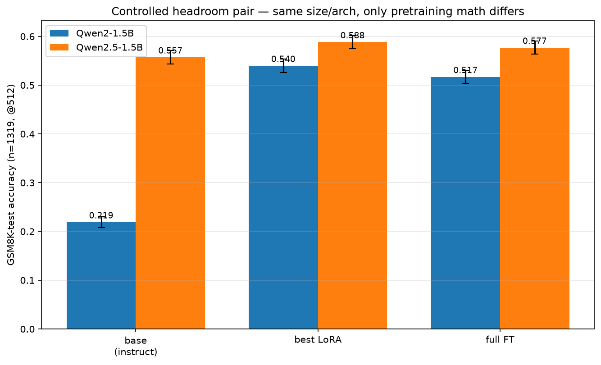
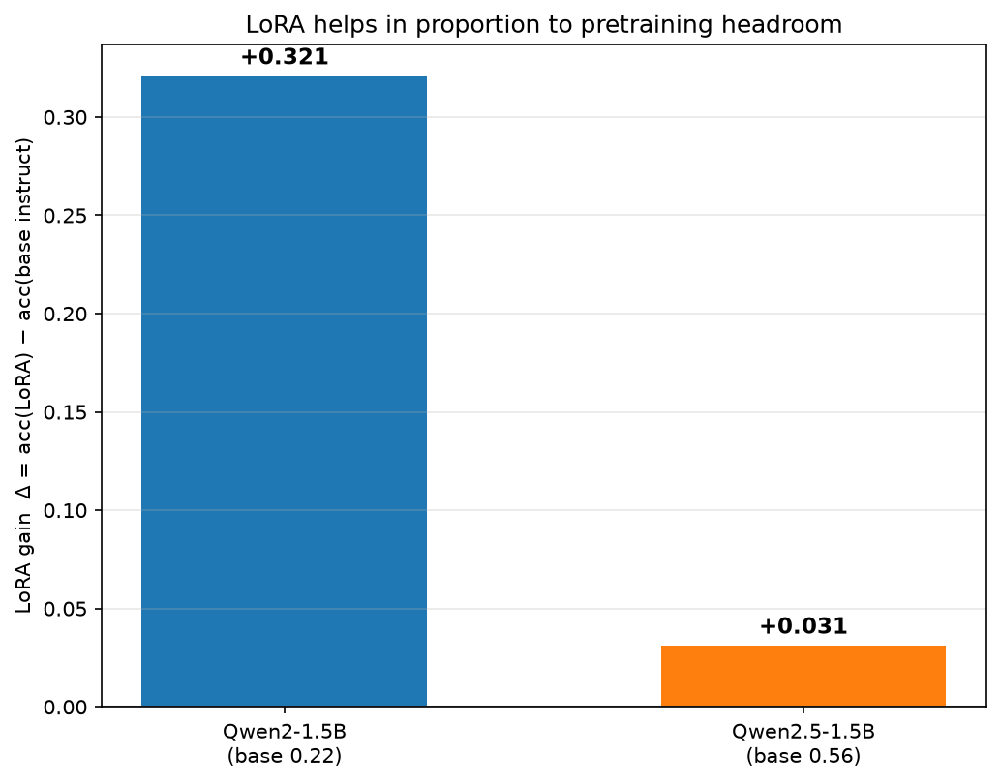
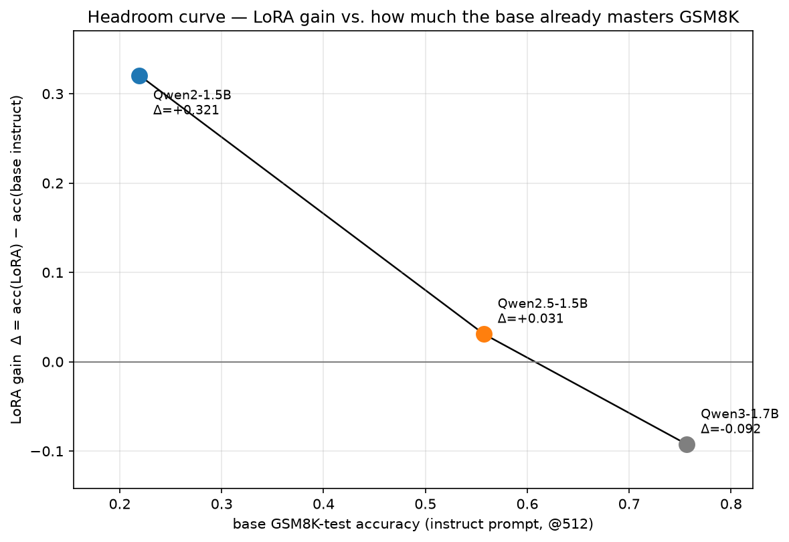
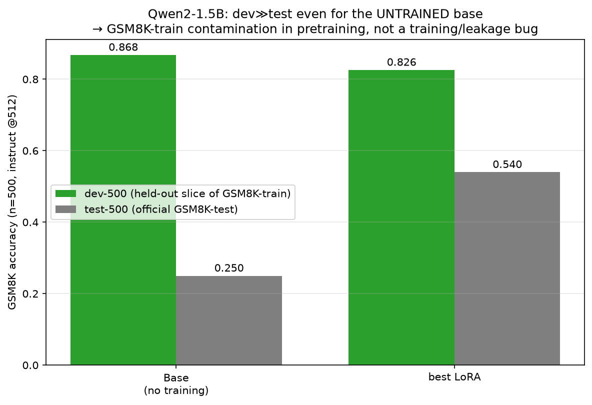

# Headroom study — LoRA gain vs. pretraining headroom

**Controlled experiment:** Qwen2-1.5B vs Qwen2.5-1.5B — identical size and architecture (28 layers, 12 Q / 2 KV heads, hidden 1536, GQA), trained with the *same* recipe (GSM8K-train → test, instruct prompt, 1 epoch, LR 2e-4, 512-token budget). The only varying factor is the base model's pretraining math level, i.e. its GSM8K headroom.

All numbers are GSM8K-**test** accuracy (n=1319) at a 512-token budget.

## Final comparison (GSM8K-test @512)

| Model | base 0-shot | base few-shot | base instruct | best LoRA | Δ (LoRA − base instruct) | full FT |
|---|---|---|---|---|---|---|
| Qwen2-1.5B | 0.481 | 0.560 | 0.219 | 0.540 | **+0.321** | 0.517 |
| Qwen2.5-1.5B | 0.409 | 0.603 | 0.557 | 0.588 | **+0.031** | 0.577 |
| Qwen3-1.7B (ref) | 0.546 | 0.709 | 0.757 | 0.664 | **-0.092** | — |

*(ref) = reference backbone trained with the identical recipe but differing in size/architecture from the controlled 1.5B pair; included only to extend the headroom range, not as a controlled cell.*

## Best LoRA configuration per model (from the dev funnels)

| Model | best LR | best target | best rank |
|---|---|---|---|
| Qwen2-1.5B | 2e-04 | attention | 1 |
| Qwen2.5-1.5B | 2e-04 | qv | 16 |

## Reading

- **Headroom effect.** The weak-pretrained Qwen2-1.5B gains **+0.321** from LoRA, the strong-pretrained Qwen2.5-1.5B only **+0.031** — LoRA helps in proportion to how much room the base model still has on the task. Extending the range with a larger reference backbone (Qwen3-1.7B, base instruct ≈0.76), the gain goes **negative** (≈−0.09): once a model already masters GSM8K, in-style SFT trades reasoning for format and *loses* accuracy.
- **Where the gain comes from (Qwen2).** The Qwen2-1.5B base ignores the `#### N` instruct format and answers in a Python-code style (its pretraining default), so its base-instruct score is low (0.22) despite real reasoning ability; LoRA mostly buys format/style compliance. 0% of these were length-truncated, so this is genuine, not an eval artifact.
- **Stage funnel.** Both models confirm 1 epoch as the operating point and LR 2e-4 as best. The high-headroom model prefers spreading a *tiny* adapter across attention (rank 1); the low-headroom model prefers a small q/v adapter (rank 16) and is actively hurt by larger target sets.

## Caveat — GSM8K-train contamination in the dev metric

The sweep dev slice is a held-out part of GSM8K-**train**. The Qwen models appear to have seen GSM8K-train during pretraining: the **untrained** Qwen2-1.5B base already scores **0.87 on dev-500 vs 0.25 on test-500** (same prompt, same budget, ~0% truncation, identical question difficulty). Since no fine-tuning is involved, this gap is pretraining memorization of the train split, not a training/leakage bug in our pipeline (train/dev indices are disjoint; 0/1000 dev items have a ≥0.8-similar train neighbor). **All headline numbers above are on the clean GSM8K-test split.** The dev metric is only used for *relative* stage decisions within a model, where the constant offset cancels.

## Figures

